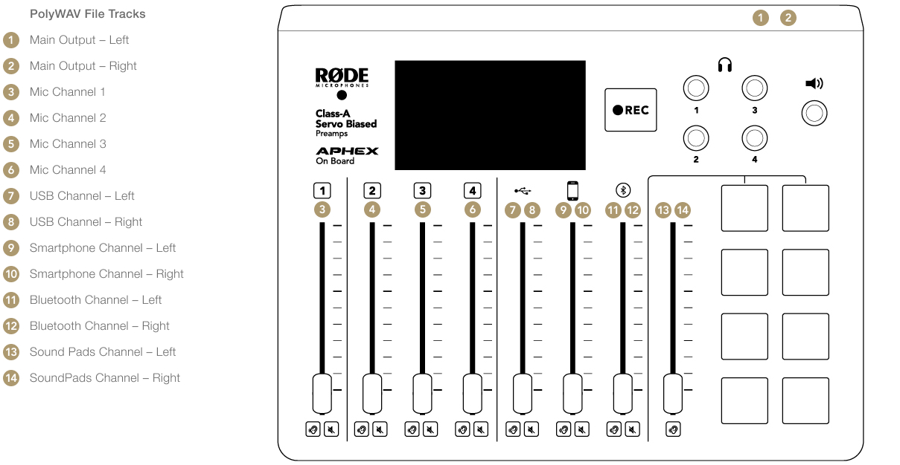

# RØDECaster Pro Multitrack Splitter

These scripts extract single WAV files from a PolyWAV file recorded by RØDECaster Pro on SD card. The scripts are written for Windows and rely on the [ffmpeg](https://www.ffmpeg.org/) program.

## Multitrack Channel Layout
The RØDECaster records the main stereo sum or all tracks in a WAV file on the SD card.

If you choose the Multitrack recording, all 14 channels are in ONE file, called multitrack file or PolyWAV.

 (Source: [https://www.rode.com/](https://www.rode.com/interfaces-mixers/rodecaster-pro/learning-hub/recording-to-microsd))

## General

The batch files (Windows only!) require one parameter and can have an optional parameter. The script does not check for existance of the inputfile and ALWAYS overwrites the output files without asking for permissions!

The first parameter is the inputfile, which is the rodecaster PolyWAV file. This filename is given to the `ffmpeg` command and processed.

The optional parameter is a prefix for the output files. If no second parameter is give, `split` will be the default prefix. The output files have a fixed second part to indicate the RØDECaster Pro channel name.

The output files are written to `.\out\<prefix>_main.wav`, where `main` is the name for the first two channels (it is a stereo file).

The ffmpeg commands within the batch files can be used with Linux and MacOS as well. Just be careful with the paths and variable names and adopt to your needs.

## Structure

This repository has three subfolder:
* [`bin`](./bin) - where the ffmpeg executable is located
* [`out`](./out) - for saving the processed files
* [`pix`](./bin) - for pictures in this README.md
* [`ref`](./ref) - for code snippets

## rc_splitall

Extracting all channels is done with `rc_splitall.bat <inputfile> <prefix>`

The single channels are exported as stereo and mono (microphones) files as follows:
```bash
###########################
LABEL   CH      IDENTIFIER
###########################
main    0-1     main
m1      2       mic1
m2      3       mic2
m3      4       mic3
m4      5       mic4
usb     6-7     usb
smart   8-9     smartphone
blue    10-11   bluetooth
SP      12-13   soundpad
###########################
```

## rc_split

If you have a simple podcasting setup without additional equipment (smartphone, PC, bluetooth), then you only need the "builtin" sources.

The command is the same as before: `rc_split.bat <inputfile> <prefix>`

Only the following channels are exported:

```bash
###########################
LABEL   CH      IDENTIFIER
###########################
main    0-1     main
m1      2       mic1
m2      3       mic2
m3      4       mic3
m4      5       mic4
SP      12-13   soundpad
###########################
```

# Acknowledgements
Thanks to all the developers that help to make ffmpeg such a wonderful tool.

A [post](https://video.stackexchange.com/questions/22024/extract-all-audio-channels-as-separate-wave-file-from-a-multichannel-file) from [user3450548](https://video.stackexchange.com/users/11789/user3450548) helped me a lot, as well as hints from Ulli Scuda, who sent me some export examples.

# Trademarks
All trademarks belong to their respective owners and are used for information only. 

This is especially true for RØDECaster(TM) and RØDE(TM), but also for FFMPEG(TM).